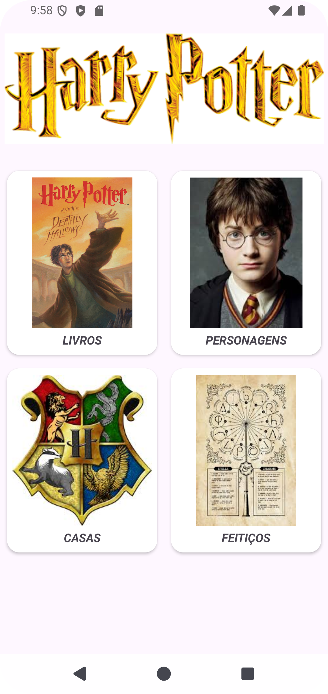

## Potter HUB MVVM

Simple project to practice API with MVVM Architecture. Main focused on show some information about the world of Harry Potter.

[Click here](https://github.com/fedeperin/potterapi) to see about the API used.

## Screenshot

    

